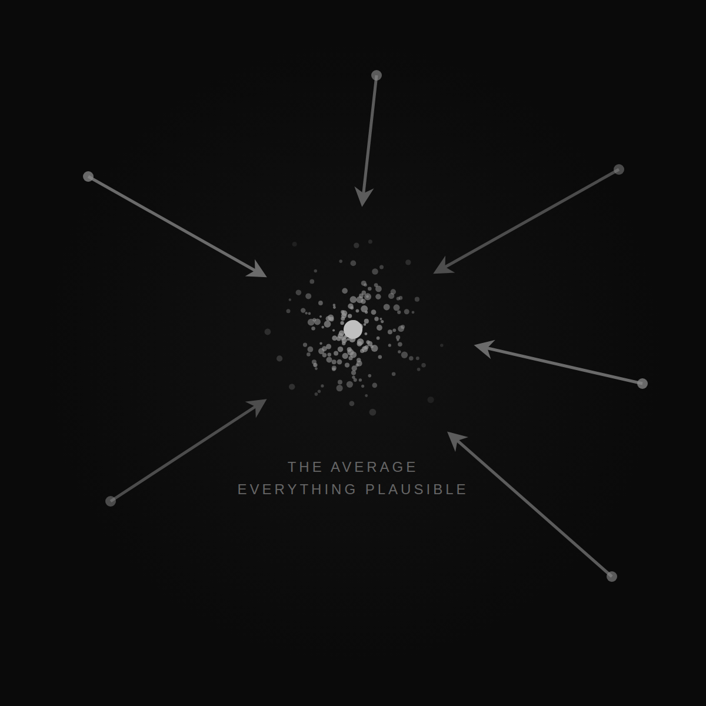
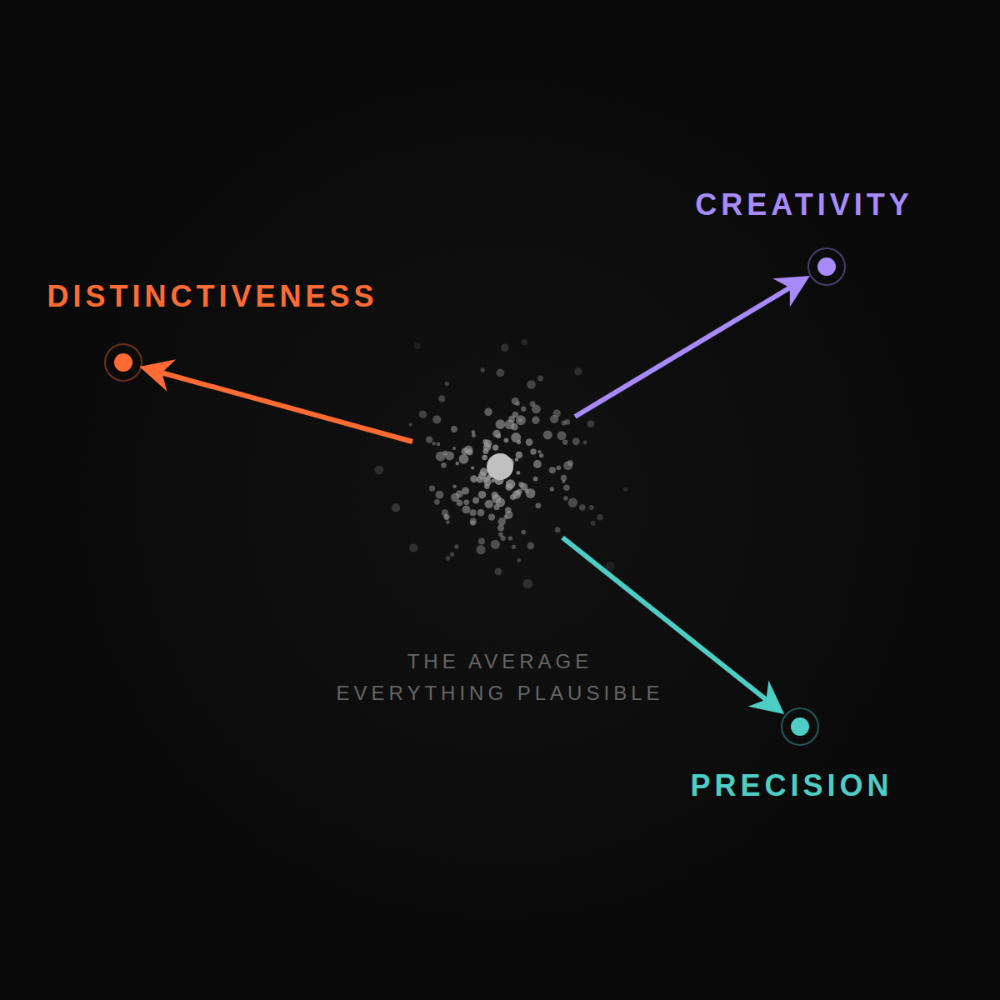

# The Next Hard Thing About Working With LLMs

I've been wondering about what happens after semi heavy lifting is solved. Now coding in some ways starts to be solved. Then composition of products starts to be solved.

But surely, once we are all there, the world will not work so that everyone is happy and everything is solved.

There is always the next hard thing.

Can you predict the next hard thing? Is that relevant now? I think it is. Because that is where our learning should be most distinct.

The LLM progression will keep solving the creation and composition. I learn that too, but I don't regard that as the main quest.

LLMs can create anything and everything, especially digital stuff. They can conjure up any idea, a solution to any problem.

Which means that everybody will have a lot of solutions.

Now that is of course the same as the saturation of the market. So once problem solving becomes easy enough, even for business problems, then we are going to be back at the fundamentals of what makes for a great business.

The point is that the LLM will give you averages. It will give you many plausible things, but the LLM still, without grounding to customers, cannot determine what is optimal and what is not optimal.

The LLM can make a guess, but still it's a guess.

And we come back to differentiation, choosing your battles and being yourself, curating, choosing where we are going to be the absolute best in our chosen field. So back to the notion of Playing to Win, differentiation by Porter, and these kinds of things.

So that's one axis: the axis of curating for something distinct.

I named the distinctiveness, or uniqueness, as the first axis. The second one is precision.

Doing precisely right for the chosen customer, in the chosen situation, on the chosen job to be done.

The precision of rightness is again something that the LLM cannot figure out on its own. However much you hypothetically ask for solutions and ask for the LLM to do the right thing, you will not get there with just more prompting.

Precision does not come from more prompting. Precision comes from more iterations with the customers. Precision is back and forth. Precision is adapting to the customer outcomes.

The third is creativity. And this is for me, in my humble opinion, the biggest one. With people, the rational is not always the right. The possible is not the optimal. The optimal is a tradeoff. Best solutions often times are flukes of circumstance and snappy thinking coming together. Again, a third similar axis that defeats the "anything is plausible."

What happens with LLMs is that it gives the most fitting answer. You really have to force the LLM to become creative.

It's totally possible to get the LLM to exhibit creativity and get out of the average behavior, but that is something where you really have to twist the LLM's arm to get there.

And that's the point, actually, of the whole blog post.

It is a classic good old: LLM gives you the average, LLM gives you the common.

But you have to do the work to actually steer it to become distinctive, differentiated, precise, and creative all at the same time.

